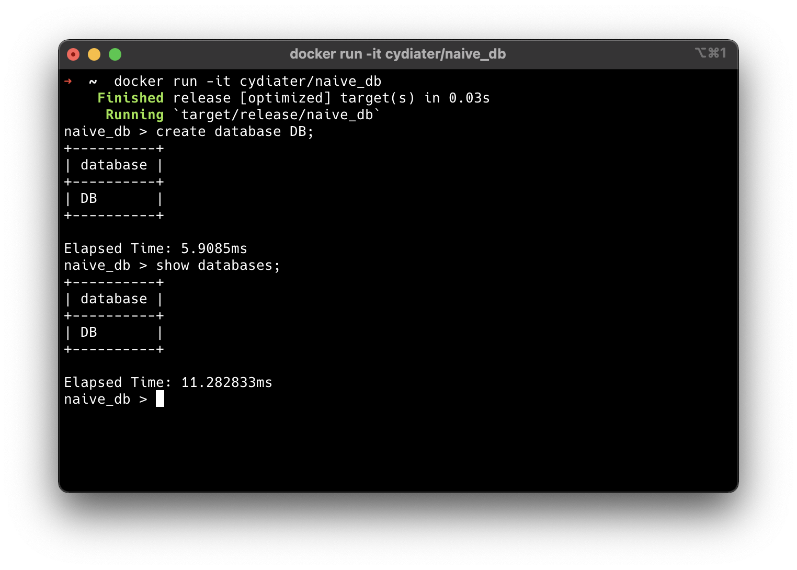
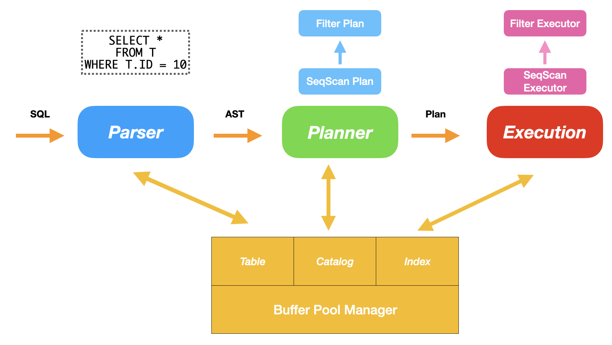

# NaiveDB 设计报告

[TOC]

## 快速开始

你可以使用现有的 Docker Image，或者从源代码进行编译。其中 Rust 工具链的安装可能需要镜像或者代理。

### 使用 Docker

```bash
docker run -it cydiater/naive_db
```

即可直接进入 NaiveDB 的终端交互界面。



### 从源代码编译

#### 安装 Rust 工具链

```bash
curl --proto '=https' --tlsv1.2 -sSf https://sh.rustup.rs | sh
```

#### 编译与运行

```bash
cargo run --release
```

#### 代码格式化与风格检查

```bash
cargo fmt
cargo clippy
```

#### 单元测试

```bash
cargo test
```

## 架构设计

我们实现的是一个面向磁盘的单用户、关系型数据库。为了简化设计，整个数据库运行在单个线程上，不支持并发操作。

### 整体架构



在整体的架构设计上，我参考了 CMU 的数据库课程 15-445 以及其中的课程项目 Bustub。这是一个面向磁盘的单用户数据库系统，其中 Buffer Pool Manager 负责管理页式文件系统，以实现在支持数据库使用巨大的存储空间的同时充分利用访存的时间、空间局部性。当数据库获取到用户输入的一条 SQL 时，Parser 会先将其解析成 AST，然后交给 Planner 进行具体的执行的规划，最后由 Execution Engine 根据 Plan 生成对应的 Executor。

在 Buffer Pool Manager 之上，我们有一些实现基本的功能所需要的数据结构。包括负责记录数据库、数据表和索引目录信息的 Catalog，记录数据表数据的 Table 以及记录索引数据信息的 Index。与传统的 In Memory 的数据结构不同，这些数据结构的基本存储单位是 Buffer Pool 提供的单位大小为 16 KB 的 Page，无法很方便的使用内置在语言内的数据结构。因此对于每个对象来说我们都需要单独的实现逐 Byte 的访问，这个实现是相对来说比较繁琐的。

### 执行模型

对于用户输入的每条 SQL，都会变成最后的 Executor 形成的树状的结构。由于我们这里采用了 Volcano 的执行模型，因此执行会自底向上运行。每次父 Executor 会向子 Executor 请求数据，父 Executor 针对数据执行完对应的操作和变换之后会返回给上一级的 Executor，最后逐步完成整体的执行。

例如对于一条 SQL 来说

```sql
UPDATE T
SET T.NAME = 'FOO'
WHERE T.ID = 10;
```

其对应的生成的树状的 Executor 结构将会是 


其中 SeqScan 会线性扫描数据表，导出所有的数据，然后由 Where 从句对应生成的 Filter 过滤我们需要的数据，然后经由 Delete 在数据表中执行删除操作，然后数据由 SET 从句生成 Transform 执行对应的修改操作，最后传导回 Insert 重新插入到相应的数据表中。这样设计的好处在于，我们可以把不同的 SQL 与对应的不同自功能解藕，减少重复的代码，同时也能方便后续的执行优化操作。

其实严格来讲，我们还应该在 Planner 和 Executor Engine 之间插入 Optimizer 执行优化的任务。例如有些数据的扫描操作其实可以利用索引而不用线性扫描，有些时候我们应该将 Project 下推来减少数据的交换。但是考虑到时间和精力限制，这里并没有实现 Optimizer，而是尽可能得在 Planner 里规划出最优的执行方案。

### 实现语言

或许和大部分人不同的是，我没有使用 CMU 课程里和助教建议的 C++，也没有使用课程提供的「祖传」代码和文法，而是自己从零使用 Rust 实现了所有部分。为什么使用 Rust？与 C++ 相比，Rust 有更现代的编译器、包管理器、报错提醒以及更安全的类型系统，我们可以以更低的成本整合他人的轮子、编写单元测试和统一代码风格等现代程序开发中不可或缺的最佳实践。

同时，相比 C++，Rust 在没有增加任何额外运行时开销的前提下保证了内存安全，但是不得不承认的是，这也在开发的过程中给我们带来了更大的心智负担。对于很多无法满足编译期类型安全的场景，我们要么选择引入 `unsafe` 来放弃类型安全，要么引入 `Rc<RefCell<_>>` ，以增加额外的性能开销来将类型安全的检查移到运行时，要么就投入更多的时间来思考怎么得到一个符合要求的实现。于是，这也就给我带来了更冗余的实现和更长的时间投入，使得最后的实现包含了 8000 行代码。

即使这样，我还是更喜欢 Rust 而非 C++，因为他所引入的更现代化的理念可以强迫我们写出更安全、更高效的代码，也许在单人的项目中，这样的好处并不明显，但是在多人的合作中，这样的条件毫无疑问可以提高整个团队的效率。

## 模块设计与接口

### Parser

由于 ANTLR 目前对于 Rust 的支持并不稳定，因此在 LALRPop 与 Nom 之间我选择了 LALRPop，自己实现了需要的文法。对于输入的一条 SQL，Parser 会将其解析成 AST 供 Planner 来进行具体的规划。同时，相比课程给出的文法而言，我在我自己设计的文法当中引入了表达式的解析，可以在 SELECT 从句和 WHERE 从句中引入比较复杂的表达式，来更为方便的执行一些操作。

目前我的表达式的 AST 的节点包括

- ColumnRefExpr：索引表的某一列
- ConstantValueExpr：表达一个常量
- LikeExpr：进行模式匹配
- BinaryExpr：表达二元的运算，目前支持了等于、大于等比较表达式

我们还可以在此之上引入加法、乘法等操作来实现更为复杂的 SQL 查询，这样设计给我们日后的扩展带来了很多可能性。

Parser 在 `crate::parser` 下提供了 `parse` 这个函数，可以输入一条 SQL 返回一个 AST。

### Buffer Pool Manager

我的存储管理是以单文件为基础的页式管理，每一页的大小是 16 KB，同时采用 Clock Replacement Policy 进行缺页的替换。这里我们之所以使用了页式管理而不是操作系统提供的 mmap，是因为内存管理是数据库性能表现中很重要的一部分，只有自己实现存储的管理才能保证数据库的性能表现在各个操作系统之间保持一致，而不会收到操作系统本身实现好坏的影响。同时，使用单文件来保证一个连续的内存空间而不是若干个文件组成的文件夹也减少了我们和操作系统的文件系统之间的耦合，同时也更方便我们进行单元测试。

由于我们实现的是页式文件系统，也就难以使用传统的 `Vector` 、`Set` 和 `Map` 这些在连续内存上的数据结构。因此我实现了一个基本的存储结构 `SlottedPage` ，来支持单页上的元数据和变长与不变长数据段的读写。`SlottedPage` 被用于 Index、Catalog、Table 和 Slice 的实现上。

BufferPoolManager 在 `crate::storage` 下提供了 `BufferPoolManager` 这个对象，包括 `BufferPoolMananger::{alloc, fetch, dealloc, unpin, new, new_random}` 等成员函数来执行基于页的访存操作，同时还提供了 `SlottedPage` 作为多个数据结构共用的存储结构。

### Table 

Table 是整个数据库中最核心的数据结构，其中存储了一张表的所有数据。具体来说，一个 Table 是由若干个 Slice 组成的，每个 Slice 是单独的一页，存储了若干条数据记录。多个 Slice 通过链表的形式连接起来构成一整个 Table，而 Table 本身在一页上，只存储了这个 Table 的一些简单的元信息，包括第一个 Slice 的 Page ID，这个 Table 的索引的 Page ID，以及这个 Table 的 Schema。

对于每个 Slice 来说，其是分配在完整的一页上，而这个页面的实际结构其实是前面提到的 SlottedPage。一个 SlottedPage 包括一个 Meta 和若干个 Key-Value 对。其中 Key 可以是 Rust 当中任何满足 Sized 的 Trait 的数据结构，即满足编译期定长，Value 是一个 bytes 数组，可以是任意长的。在 SlottedPage 上已经实现了插入、删除以及在满足偏序关系下二分查找等操作，因此在 Slice 中只需要简单的调用已经实现好的 API 就可以实现大部分需要的操作。

在 Slice 中，我们的 Data 就是每个 Tuple 序列化后的 Bytes，而 Key 是每个记录的被索引计数。当一个 Table 的作为外键被另一个表引用了一次后，对应的计数器加一，我们以此来保证外键的约束。同时每个 Slice 还存储了一个指向这个 Table 的 Schema 的 Reference，用于插入、删除等合法性的判断。Schema 则是若干个简单的向量构成的 Struct，存储了每一列的数据类型、列名以及相关的 Primary Key 以及约束等。

Table 在 `crate::table` 下提供了 `Table` 这个对象，包括 `Table::{insert_at, remove, append, tuple_iter}` 等接口负责数据段的增删改查等操作。

### Index

Index 承担了数据库的索引功能，加速相关的查询操作。我实现的 Index 的数据结构是 B+ 树，一个 B+ 树包括了一个存储元信息的页，以及形成树状结构的 LeafNode 和 InternalNode，每个节点都恰好占据了一页。不管是 InternalNode 还是 LeafNode，其底层都是和 Slice 一样的 SlottedPage，通过一些额外的操作在外层保证插入和删除是有序的，具体的实现可以参考代码。

在实现上，Index 和 Table 是平行的记录在 Catalog 里的，同时在 Table 的 Metadata 里也记录了这个 Table 对应的主键的 Index 的 Page ID，这样就可以帮助我们避免重复对多个相同的列建重复的 Index。同时也减少了增删 Index 与增删 Table 重复的代码。

Index 在 `crate::index` 下提供了 `BPTIndex` 这个对象，包括 `BPTIndex::{insert, remove, iter_start_from}` 来实现插入、删除和区间迭代。

### Catalog

Catalog 可以理解为一个简单的 Map，以树状结构记录了整个系统的数据库、表、索引的信息，其实现也是基于前面所提到的 SlottedPage 进行的。

Catalog 在 `crate::catalog` 下提供了 `CatalogManager` 这个对象，包括 `CatalogManager::{create_database, create_table, use_table, find_table, find_indexes_by_table}` 等操作，来实现基本的创建删除数据库、数据表的功能。

### Planner

Planner 负责将用户输入的 SQL 所转换成的 AST 生成对应的 Plan，这里也是相对来说 hard-code 比较多的地方，因为我需要手动的将输入的 AST 翻译成合理的 Plan，并做一些必要的优化。其中对于不少操作来说例如只是创建一个数据库这样的操作，Planner 只会将其翻译成一个节点传递给 Executor。对于大部分的询问操作来说，我们会尽可能的生成一个比较优的 Plan，交给 Executor 来执行。

Planner 在 `crate::planner` 下提供了 `Planner` 这个对象，包括 `Planner::plan` 这个接口，负责把 AST 转换成一个具体的 Plan。

### Execution Engine

与 Planner 类似，Execution Engine 的作用是把树状的 Plan 一对一的转化成树状的 Executor，然后自下而上的迭代执行，以得到最后的结果。

Execution Engine 在 `crate::execution` 下提供了 `ExecutionEngine` 这个对象，包括 `ExecutionEngine::execute` 这个借口，负责迭代的调用根 Executor 以得到最后的结果。

## 实验结果

我最后的结果包括大约 8000 行代码，算是一个不大不小的工程项目了。我最后支持的功能包括

- 数据库增删改查
- 数据表 Schema 以及约束的增删改查
- 创建索引以加速查询操作
- 查询的 Project 和在 Where 从句里的 Filter，包括字符串的模式匹配
- 简单的聚合查询，包括 GROUP BY

同时，我的项目里还包括了约三十个单元测试，以充分的保证正确性


## 参考文献

[1] [CMU 15-445 Introduction to Database System](https://15445.courses.cs.cmu.edu/fall2021/)

[2] Bustub, [Github](https://github.com/cmu-db/bustub)

